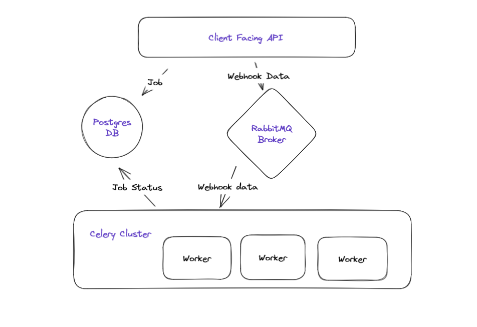

Job Scheduler Python
========================

This is an example Flask web server backed by Postgres and Celery that is able to schedule API calling tasks.

## High Level Design



## Assumptions When Building the App
1. It's only possible to schedule future tasks i.e. negative `hours`, `minutes`, and `seconds` are not allowed
2. If a job's scheduled execution time has passed, `get_times` would return 0 instead of a negative number
3. Our API is premissive and casts any non `int` number into an `int` but we don't convert 0.5 hours into 30 minutes
4. Since it was not specified explicitly and the example did cover this, I assumed that we append the counter id after 
the path of the URL (and not just the hostname) and we drop other params as they may be inapplicable in that path
5. URL is a mandatory paramter and we impose strict validation on it (requireing scheme and netloc). We also only permit up to 200
characters but this can be changed easily
6. Our API only allows for forward scheduling information i.e. non negative hours, minutes, seconds
7. in `worker.py` I preferd the application to fail if WEBHOOK_TIMEOUT isn't a number since this would make development
and bug triage easier. I also didn't cap this value as this is a developer's configuration and I leave this to their discretion
8. Celery's `eta` feature isn't extermely accurate and can result in some lags in execution. This can be handled by tinckering with
some configurations e.g. `worker_timer_precision`

## Prerequisits Before Running the Project

1. If not already present, install Python 3.11 and [virtualeenvwrapper](https://pypi.org/project/virtualenvwrapper/)
2. Create and activate a local virtualenv
```bash
$ mkvirtualenv {your-env-name}
```
3. Add the root of the project to your `PYTHONPATH`
```bash
$ export PYTHONPATH={path-to-root-folder}
```
3. Install project dependencies using
```bash
$ pip install -r requirements.txt
```
4. Install [Docker](https://docs.docker.com/get-docker/)
5. Install/Enable [K8s and kubectl](https://kubernetes.io/docs/tasks/tools/)

## Running the App

### Executing Tests

#### Unit Tests
We use [nox](https://nox.thea.codes/en/stable/tutorial.html#running-nox-for-the-first-time) as our testing framework. To run the tests do the following:
1. Install `nox` (comes in the project's `requirements.txt`)
```bash
$ pip install nox
```
2. Run `nox` a nox session e.g. `unit_test`. `nox` will then execute all tests in the given session.
```bash
$ nox --session unit_test -f noxfile.py
```

### Running Using Vanilla Docker
1. Make sure you have `Docker` installed
2. `cd` to the project's root folder
2. Build the `job-scheduler-web` image (from project's root)
```bash
$ docker build -t job-scheduler-web -f web/Dockerfile .
```
3. Build the `job-scheduler-worker` image (from project's root)
```bash
$ docker build -t celery-worker -f webhook/Dockerfile .
```
4. Run the K8s deployment (from project's root)
```bash
$ kubectl apply -f k8s/deployment.yaml
```
5. Run the DB migrations (from project's root)
```bash
$ export DJANGO_SETTINGS_MODULE=settings POSTGRES_DB=timer POSTGRES_USER=db_user POSTGRES_PASSWORD=db_password
$ python manage.py migrate
```
6. You can now access the API via `POST http:localhost:5000/timers` or `GET http:localhost:5000:timers/{task-id}`
7. To kill the containers and clean up resources run
```bash
kubectl delete namespace job-scheduler-namespace
```

## Feature Backlog
Given the limited time and scope of the project there are many things I would have wanted to add.
I've listed below the main highlights.

1. Secure credentials for Postgres, RabbitMQ etc.
2. Adding User management, API tokens, rate limiting and quota etc.
3. Adding monitoring, metrics (e.g. failed webhooks, user usage metrics, worker liveliness, API liveliness etc.)
4. Adding tracability from API to Celery workers using GUIDs
5. For production scalability we need to deploy auto-sccaling groups for API, Celery, and potentially shard the DB
6. We should also consider moving Celery to be based on SQS or other high-scale platform
7. There's additional logic we can add to make the Celery workers more robust and handle connection issues etc.
8. For ease of development I would add CI and build options so the process isn't so manual
9. I would add many more E2E tests, negative tests, and load tests
10. As with most systems, we would need more documentation 

There are many other features we can think of, but this is of the top of my head ;)
